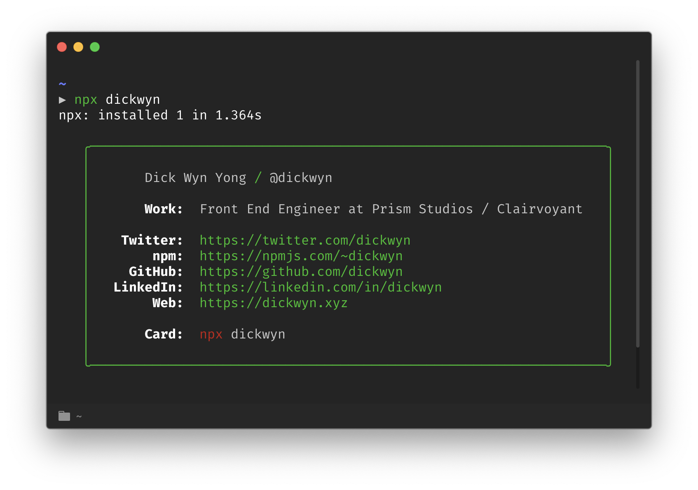

# npmcard



It's me, dickwyn on npm.

## Installation

```sh
$ npx dickwyn
```

## Inspiration

1. [Hui Jing](https://github.com/huijing/hj_chen)
2. [Tierney Cyren](https://github.com/bnb/bitandbang)
3. [Conlin Durbin](https://dev.to/wuz/setting-up-a-npx-username-card-1pip)

## License

The contents of this repository are covered under the [MIT License](https://github.com/dickwyn/npmcard/blob/master/LICENSE)
